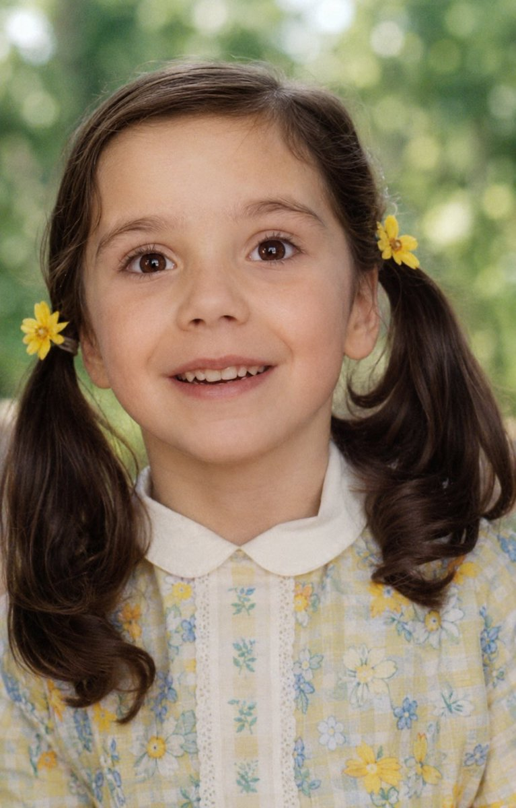
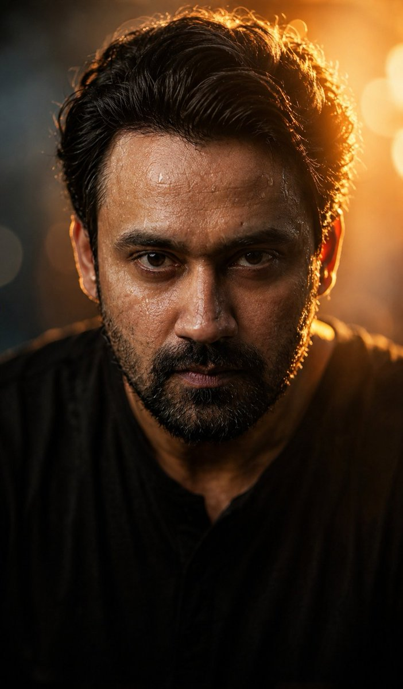
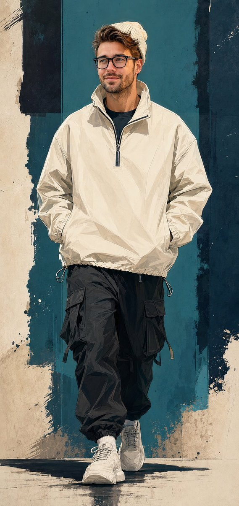
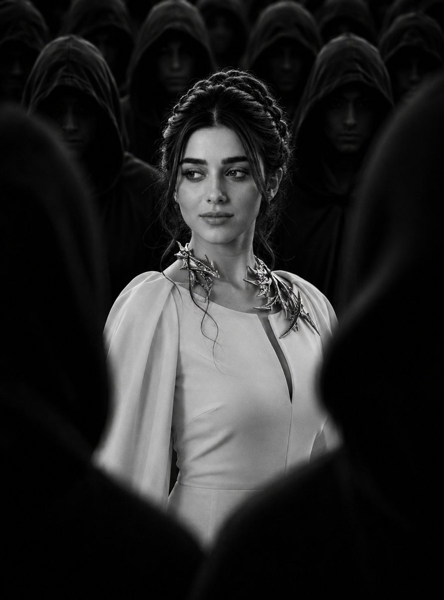

# Portrait Prompt Atlas

> GPT Image 2 人像处理提示词图鉴：集中收录、按场景整理，让需要的人快速找到合适的提示词。

[中文说明](#中文) · [English](#english) · [在线图鉴](https://portrait.mizzlelover.xyz) · [X：@dboy_yi2025](https://x.com/dboy_yi2025) · [精选效果图](docs/showcase.md) · [Agent Skill](docs/agent-skill.md) · [语料清理与分类](docs/corpus-curation.md) · [对标说明](docs/benchmark.md) · [版权与署名规则](docs/copyright-and-attribution.md)

<p align="center">
  
  
  
  
</p>

## 仓库内效果预览

提示词不只以 JSON 或长文本出现。下面直接展示四条精选记录的结果图；点击图片可进入对应详情页，查看原文摘要、分类、身份保持状态和 X 来源。完整的八条精选案例见[效果图画廊](docs/showcase.md)。

<table>
<tr>
<td width="25%"><a href="docs/cases/GI2_01583.md"></a><br><strong>老照片与破损修复</strong><br><sub>GI2_01583 · @iamrealsnow</sub></td>
<td width="25%"><a href="docs/cases/GI2_04109.md"></a><br><strong>自拍、脸部与近景精修</strong><br><sub>GI2_04109 · @iamahmedfaraz66</sub></td>
<td width="25%"><a href="docs/cases/GI2_21341.md"></a><br><strong>插画、素描与动漫转换</strong><br><sub>GI2_21341 · @de_mon010</sub></td>
<td width="25%"><a href="docs/cases/GI2_21354.md"></a><br><strong>棚拍美妆与近景肖像</strong><br><sub>GI2_21354 · @AiwithLariab</sub></td>
</tr>
</table>

> 图片来自仓库内 `assets/images/`，每张图都与一条原始提示词记录配对；来源发布者与作者核验状态不会被省略。

## 中文

这不是一个把提示词堆在一起的仓库，而是一套面向真人照片的可追溯图鉴：帮助你从真实需求出发，找到修复、自然美化、身份保持、职业头像和纪念照片处理的参考方案。

每条提示词都按来源原样保存：中文仍是中文，英文仍是英文；本仓库不把它们翻译成另一种语言，也不把发布账号未经核验地当成原创作者。

### 在线浏览

访问 [Portrait Prompt Atlas 在线图鉴](https://portrait.mizzlelover.xyz)，可按处理方向、具体场景和身份保持强度筛选，查看结果图、原始提示词与 X 来源链接，并一键复制。

### 当前收录

- 728 条原始 X 来源记录经范围筛选与近重复归并后，公开图鉴保留 519 条，日期范围为 2026-05-27 至 2026-08-12。
- 每条记录均有一张对应结果图、X 原帖链接、来源发布者和作者核验状态。
- 剔除 146 条不属于“真人参考图人像处理”的案例，并归并 56 个重复簇中的 63 条重复记录；原始池、自动判断、视觉巡检与归并审计均可复核。
- 8 个处理方向与 17 个当前有记录的具体场景，详见[语料清理与分类](docs/corpus-curation.md)。

### 致谢

特别感谢 [苍何](https://github.com/freestylefly) 创建的 [awesome-gpt-image-2](https://github.com/freestylefly/awesome-gpt-image-2)。它以开源图鉴、演示站和 Agent 使用方式呈现 GPT Image 2 提示词库，启发了本项目把已收集的人像处理资料整理为一个更专注于修复、自然精修与身份保持的开源库和演示站。

本项目独立收集、筛选和维护人像方向记录；不复制对方的提示词、文案、视觉设计或商业功能。具体边界见[对标说明](docs/benchmark.md)。

### 分类总览

| 方向 | 记录数 | 典型用途 |
| --- | ---: | --- |
| 修复与影像保全 | 4 | 老照片、清晰度、上色和破损修复 |
| 自然精修与美化 | 10 | 肤质、妆容、自然美化与轻修饰 |
| 职业头像与形象 | 5 | 职业头像、企业形象与商务照片 |
| 生活方式与旅行人像 | 15 | 旅行、街拍、日常与环境肖像 |
| 时尚与编辑肖像 | 153 | 时尚写真、杂志感与高定表达 |
| 身份锁定风格转换 | 173 | 插画、动漫、点云与艺术化转换 |
| 纪念、家庭与关系影像 | 4 | 家庭、伴侣、儿童与纪念照片 |
| 创意肖像与场景表达 | 155 | 电影感、人物海报、概念创意与场景重构 |

### 让 Claude Code 与 Codex 使用图鉴

仓库内置 `gpt-image-2-portrait-library` Skill。它不是单纯的安装说明：包内带有 519 条清理后的原语言记录、来源与身份保持字段、命令行检索、可复现的生成器和完整性校验。网站目录与 Agent Skill 由同一份研究主库生成，因此不会出现网站和 Agent 使用不同提示词版本的情况。

```bash
npx skills add mizzlelover/portrait-prompt-atlas --skill gpt-image-2-portrait-library --agent claude-code codex --global --yes --copy
```

安装后可直接提出：

```text
使用 gpt-image-2-portrait-library，为一张旅行人像找一个自然、保留身份的处理方案。
```

Claude Code 也可使用插件市场：

```text
/plugin marketplace add mizzlelover/portrait-prompt-atlas
/plugin install gpt-image-2-portrait-library@portrait-prompt-atlas
```

Skill 支持三种工作模式：从收录库中找原始提示词、在原文之外明确给出修改补丁、或在无合适来源时标记为全新创作。无论何种模式，均不翻译已有提示词，也不把未核验发布者写成原创作者。详见 [Agent Skill 使用说明](docs/agent-skill.md)。

维护者更新研究主库后运行：

```bash
npm run curate:portrait-library
npm run generate:portrait-skill
npm test
```

GitHub Actions 会检查生成文件、提示词原文一致性、X 来源链接及 Skill 打包完整性。

### 署名与使用边界

| 状态 | 页面展示 | 提示词展示 |
| --- | --- | --- |
| `original_creator_self_claimed` | 已核验原创作者、原始 X 帖文、证据 | 附署名公开 |
| `repost_creator_credited` | 原创作者优先、转载者其次、证据 | 附署名公开 |
| `publisher_unverified` | 来源发布者、原始 X 链接、未核验标识 | 附来源与更正渠道公开 |
| `repost_creator_unknown` / `source_not_verifiable` | X 链接与来源未知标识 | 作为研究记录公开，不主张作者身份 |

创作者可随时提出更正或移除请求，详见[署名与更正流程](docs/copyright-and-attribution.md#corrections-and-removal)。

## English

Portrait Prompt Atlas is a focused, searchable atlas for GPT Image 2 portrait editing, restoration, retouching, and identity-preserved transformations. It organizes original prompts by outcome and scenario so people looking for portrait-editing workflows can find the right case quickly. Prompts remain in their source language and link back to the X source, with a clear distinction between publisher and verified prompt author.

Browse the [live catalog](https://portrait.mizzlelover.xyz) or install the included `gpt-image-2-portrait-library` skill for Claude Code and Codex:

```bash
npx skills add mizzlelover/portrait-prompt-atlas --skill gpt-image-2-portrait-library --agent claude-code codex --global --yes --copy
```

## Research corpus

- 728 raw X-source records dated 2026-05-27 to 2026-08-12; 519 curated records are published after scope filtering, visual review, and duplicate clustering.
- One matched result image has been downloaded for every record.
- Every record has a publisher / authorship status and a rule controlling whether its full prompt may be published.
- Current rights gate: no prompt is treated as publicly reusable merely because the X publisher is known.

The public corpus preserves the original X-source link, the source publisher where available, the attribution status, one source result image, and a correction path on every record. A publisher handle is labelled as a publisher, never silently promoted to “prompt author.”

## Portrait-specialist categories

| Category | Records | Typical use |
| --- | ---: | --- |
| Restoration & preservation | 4 | Old-photo, clarity, color and repair-oriented workflows |
| Natural retouch & beauty | 10 | Natural skin, beauty and light retouching |
| Professional headshot & brand | 5 | Headshots, corporate identity and business output |
| Lifestyle & travel portrait | 15 | Travel, lifestyle and environmental portraits |
| Editorial & fashion portrait | 153 | Fashion, magazine and editorial work |
| Identity-locked style transfer | 173 | Illustration, anime, point-cloud and art-direction transfers |
| Memory, family & relationship | 4 | Family, couples, children and memorial work |
| Creative portrait & scene | 155 | Cinematic, portrait-poster, concept and scene reconstruction |

The category, image link, attribution state, risk flags, and rule-based evaluation are all queryable in `data/prompts.jsonl` and `data/evaluations.jsonl`.

## What makes a record publishable

| Status | Public display | Full prompt |
| --- | --- | --- |
| `original_creator_self_claimed` | Original creator, original X post, evidence | Allowed with attribution |
| `repost_creator_credited` | Original creator first, reposter second, evidence | Allowed with attribution |
| `publisher_unverified` | Source publisher, original X link, explicit unverified label | Public with attribution and correction path |
| `repost_creator_unknown` / `source_not_verifiable` | Original X link and explicit provenance-unknown label | Public as a research record; never assert an author |

Creators can request correction or removal at any time. See [correction and removal](docs/copyright-and-attribution.md#corrections-and-removal).

## Evaluation model

Each candidate is assessed through six distinct lenses, described in [the evaluation model](docs/evaluation-model.md):

1. Identity preservation
2. Natural-retouch realism
3. Technical control and failure prevention
4. Task and commercial usefulness
5. Reference-image dependency
6. Rights and safety readiness

This prevents a visually impressive but identity-breaking style transfer from being ranked alongside a reliable natural headshot retouch.

## Data layout

- `data/raw-prompts.jsonl` is the immutable discovery pool; `data/prompts.jsonl` is the curated public corpus, with range and near-duplicate decisions in `data/curation-audit.json`.
- `data/image-manifest.jsonl` maps every prompt record to one downloaded result image.
- `assets/images/` holds one result image per record for internal review.

The result images are retained together with their record-level source links so that a visitor can judge the prompt as a visual workflow rather than as isolated prose.

## Acknowledgements

Special thanks to [Canghe / freestylefly](https://github.com/freestylefly) and [awesome-gpt-image-2](https://github.com/freestylefly/awesome-gpt-image-2). Its open-source presentation of a GPT Image 2 library, live catalog, and agent workflow inspired the structure of this portrait-specialist library and its demo site. This project independently collects and curates its portrait records; it does not copy the reference project's prompts, copywriting, visual design, or commercial features.

The research source pool was discovered through [Goku-OpenLab/gpt-image-2-prompts-datasets](https://huggingface.co/datasets/Goku-OpenLab/gpt-image-2-prompts-datasets), licensed CC BY 4.0. That dataset-level license does not establish who authored each X prompt; this project therefore preserves individual X-source attribution and applies the stricter record-level publication gate above.
