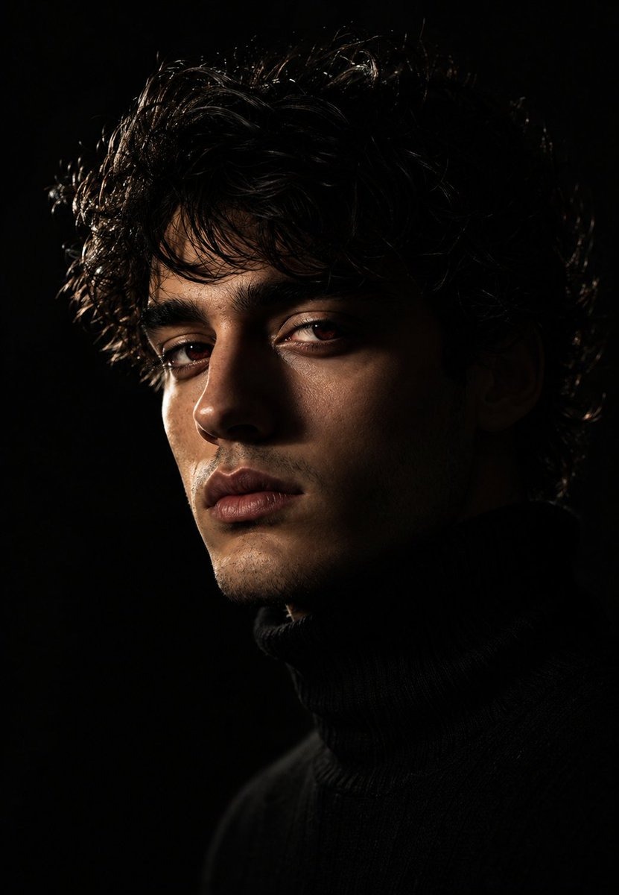
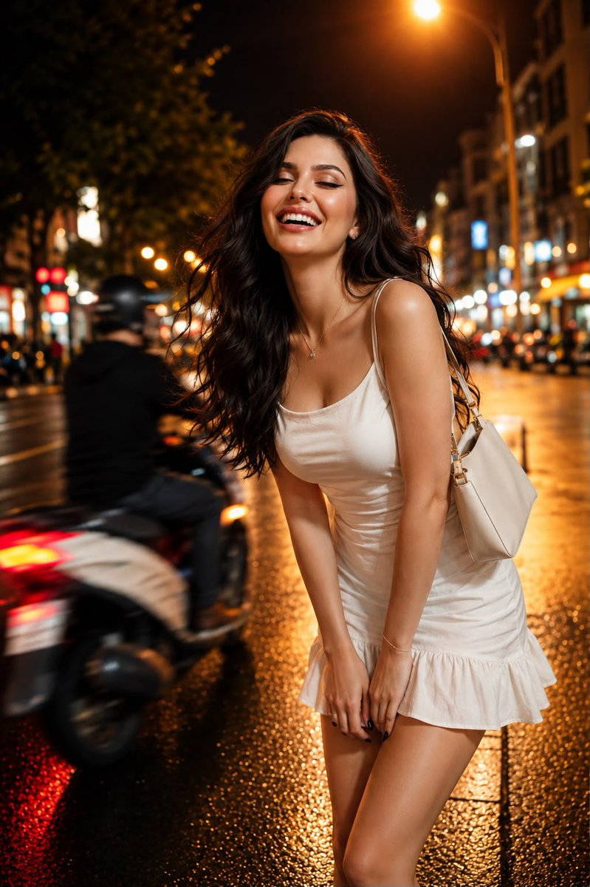
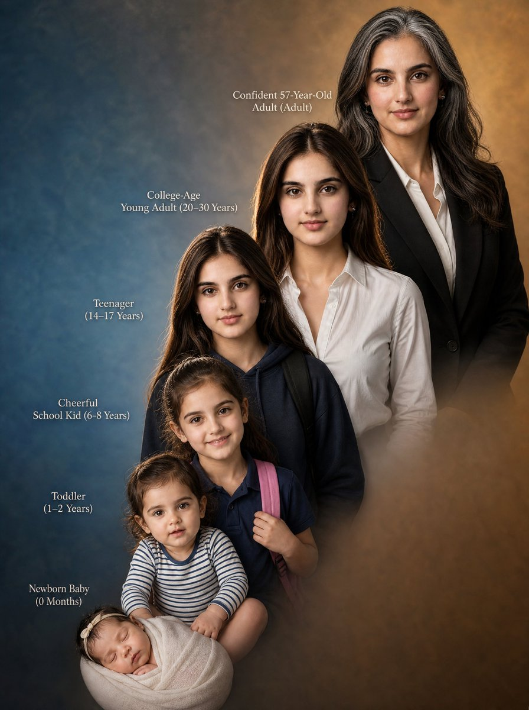
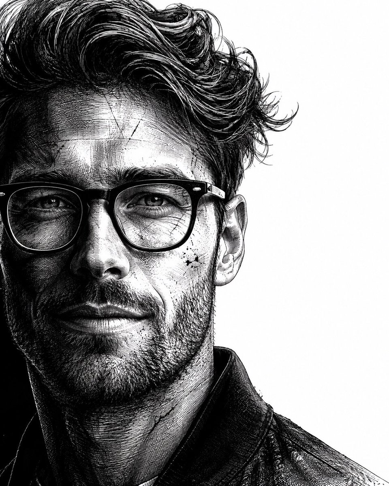

# 精选效果图 / Visual showcase

> 这里把“提示词”和“结果图”放在一起看。图片来自仓库内 `assets/images/`，每一张都对应 `data/prompts.jsonl` 中的一条记录，并保留来源发布者、作者核验状态和原始 X 帖文。
>
> This page pairs each original-language prompt record with its result image. Every case keeps a publisher, authorship status, and source link so the visual result is never separated from its provenance.

## 先看效果 / Start with the images

<table>
<tr>
<td width="50%">
 
<strong>1. 老照片与破损修复</strong> 
Restoration &amp; preservation · GI2_01583 · @iamrealsnow 
<small>Using the provided reference image, refine and restore the old damaged photo into a clean, realistic original snapshot. Remove all cracks, creases, scratches, faded discoloration, stains, an…</small>
</td>
<td width="50%">
 
<strong>2. 自拍、脸部与近景精修</strong> 
Natural retouch &amp; beauty · GI2_04109 · @iamahmedfaraz66 
<small>A hyper-realistic cinematic close-up portrait of a {argument name=&quot;subject&quot; default=&quot;man, face glistening with water droplets and sweat scattered across the skin&quot;}, ultra-detailed skin textu…</small>
</td>
</tr>
<tr>
<td width="50%">
 
<strong>3. 商务头像与职业主页照</strong> 
Professional headshot &amp; brand · GI2_01089 · @Ozayrr_irl 
<small>Use the Exact same face from reference image and generate a Close-up studio portrait headshot of an {argument name=&quot;subject&quot; default=&quot;man with sharp jawline and defined facial features, dark…</small>
</td>
<td width="50%">
 
<strong>4. 日常与社交人像</strong> 
Lifestyle &amp; travel portrait · GI2_21669 · @mehvishs25 
<small>Use the uploaded reference image as the only identity reference. Preserve the subject’s exact facial features, face shape, eye shape, nose, lips, skin tone, hairstyle, proportions, and overa…</small>
</td>
</tr>
<tr>
<td width="50%">
 
<strong>5. 棚拍美妆与近景肖像</strong> 
Editorial &amp; fashion portrait · GI2_21354 · @AiwithLariab 
<small>Create a cinematic black-and-white fantasy editorial portrait of {argument name=&quot;subject&quot; default=&quot;me standing confidently in the center of a large mysterious crowd&quot;}. The camera is position…</small>
</td>
<td width="50%">
 
<strong>6. 插画、素描与动漫转换</strong> 
Identity-locked style transfer · GI2_21341 · @de_mon010 
<small>Use the uploaded reference image as the ONLY facial identity reference. Preserve the exact same person with maximum fidelity. Maintain the identical facial identity, facial structure, skull …</small>
</td>
</tr>
<tr>
<td width="50%">
 
<strong>7. 创意合成与人物海报</strong> 
Memory, family &amp; relationship · GI2_00893 · @AiWithTariq 
<small>Create a meticulously detailed vertical composite studio photograph showing the life progression of the same {argument name=&quot;gender&quot; default=&quot;female&quot;} person from birth to mature adulthood, …</small>
</td>
<td width="50%">
 
<strong>8. 电影感与奇幻场景肖像</strong> 
Creative portrait &amp; scene · GI2_21082 · @de_mon010 
<small>Use the uploaded reference image as the identity source. Preserve the subject&#039;s identity with maximum accuracy. Maintain the original facial structure, facial proportions, skin tone, eye sha…</small>
</td>
</tr>
</table>

## 如何阅读 / How to read a case

- 点击图片或案例标题进入详情页，可看到分类、具体场景、构图范围、身份保持状态、来源与提示词原文摘要。
- 详情页的“完整原文”链接会定位到 `data/prompts.jsonl` 的对应行；原提示词保持来源语言，不翻译、不改写。
- `publisher_unverified` 只表示“来源发布者已知、原创作者尚未核验”，不把发布者直接写成作者。
- 如果你是作者或权利人，请按[更正与移除流程](copyright-and-attribution.md#corrections-and-removal)提出请求。

## 精选案例索引 / Case index

| ID | 处理方向 | 具体场景 | 发布者 | 原始来源 |
| --- | --- | --- | --- | --- |
| [GI2_01583](cases/GI2_01583.md) | 修复与影像保全 | 老照片与破损修复 | @iamrealsnow | [X 帖文](https://x.com/iamrealsnow/status/2060555120539210234#reversed-1) |
| [GI2_04109](cases/GI2_04109.md) | 自然精修与美化 | 自拍、脸部与近景精修 | @iamahmedfaraz66 | [X 帖文](https://x.com/iamahmedfaraz66/status/2064177637527114088) |
| [GI2_01089](cases/GI2_01089.md) | 职业头像与形象 | 商务头像与职业主页照 | @Ozayrr_irl | [X 帖文](https://x.com/Ozayrr_irl/status/2060372607804064158) |
| [GI2_21669](cases/GI2_21669.md) | 生活方式与旅行人像 | 日常与社交人像 | @mehvishs25 | [X 帖文](https://x.com/mehvishs25/status/2083383385167380969) |
| [GI2_21354](cases/GI2_21354.md) | 时尚与编辑肖像 | 棚拍美妆与近景肖像 | @AiwithLariab | [X 帖文](https://x.com/AiwithLariab/status/2087028978888720695) |
| [GI2_21341](cases/GI2_21341.md) | 身份锁定风格转换 | 插画、素描与动漫转换 | @de_mon010 | [X 帖文](https://x.com/de_mon010/status/2087032920297148428) |
| [GI2_00893](cases/GI2_00893.md) | 纪念、家庭与关系影像 | 创意合成与人物海报 | @AiWithTariq | [X 帖文](https://x.com/AiWithTariq/status/2061629697386287356#reversed-0) |
| [GI2_21082](cases/GI2_21082.md) | 创意肖像与场景表达 | 电影感与奇幻场景肖像 | @de_mon010 | [X 帖文](https://x.com/de_mon010/status/2085567605599826079) |

本页由 `npm run generate:github-showcase` 生成。精选案例 ID、图片路径和提示词摘要均从 `data/prompts.jsonl` 读取，避免 README、详情页和研究主库出现不同步。
